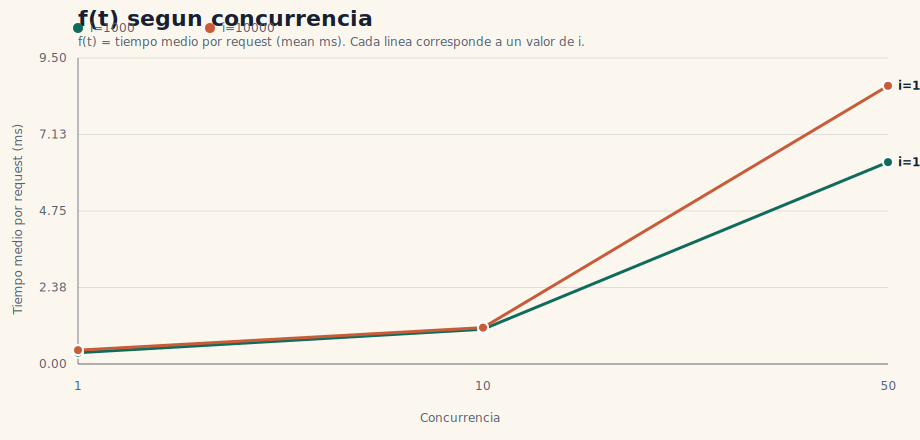

# TP2 - Analisis de ApacheBench

- Generado: `2026-03-31T01:53:48Z`
- Endpoint base: `http://127.0.0.1:8080/pi`
- Requests por corrida: `60`
- Iteraciones: `1000,10000`
- Concurrencias: `1,10,50`

## Tabla base

| i | c | req/s | mean ms | p95 ms | failed |
| --- | --- | --- | --- | --- | --- |
| 1000 | 1 | 2839.43 | 0.35 | 0.00 | 0 |
| 1000 | 10 | 9222.26 | 1.08 | 1.00 | 0 |
| 1000 | 50 | 7972.36 | 6.27 | 5.00 | 0 |
| 10000 | 1 | 2310.18 | 0.43 | 1.00 | 0 |
| 10000 | 10 | 8845.64 | 1.13 | 2.00 | 0 |
| 10000 | 50 | 5784.25 | 8.64 | 6.00 | 0 |

## Grafico f(t) segun concurrencia

Tomamos `f(t)` como el tiempo medio por request (`mean ms`) y usamos la concurrencia como eje horizontal.

## Tabla derivada

| i | speedup c=10 | speedup c=50 | p95 penalty c=10 | p95 penalty c=50 |
| --- | --- | --- | --- | --- |
| 1000 | 3.25 | 2.81 | inf | inf |
| 10000 | 3.83 | 2.50 | 2.00 | 6.00 |

## Analisis automatico

- i=1000: mejora moderada hasta c=10 (speedup 3.25x), pero a c=50 el throughput casi no mejora frente a c=10 y la latencia aumenta, indicando saturacion
- i=10000: mejora clara hasta c=10 (speedup 3.83x), pero a c=50 el throughput casi no mejora frente a c=10 y la latencia aumenta, indicando saturacion

## Conclusion

- No se observaron failed requests: el servidor fue robusto en el rango probado.
- En general el servidor escala bien al menos hasta la primera concurrencia evaluada por encima de c=1.
- A concurrencias altas aparece saturacion: el throughput deja de crecer en proporcion y la latencia aumenta.
- Hay un tradeoff visible entre throughput y latencia: aun cuando mejora el req/s, el p95 crece de forma apreciable.
