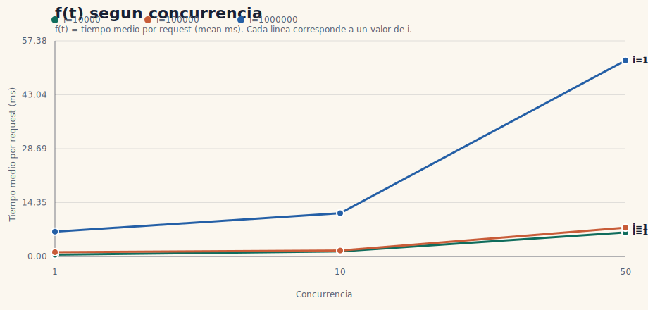

# TP2 - Analisis de ApacheBench

- Generado: `2026-03-31T21:23:41Z`
- Endpoint base: `http://127.0.0.1:8080/pi`
- Requests por corrida: `500`
- Iteraciones: `10000,100000,1000000`
- Concurrencias: `1,10,50`

## Tabla base

| i | c | req/s | mean ms | p95 ms | failed |
| --- | --- | --- | --- | --- | --- |
| 10000 | 1 | 2085.26 | 0.48 | 1.00 | 0 |
| 10000 | 10 | 7414.33 | 1.35 | 2.00 | 0 |
| 10000 | 50 | 7811.89 | 6.40 | 7.00 | 0 |
| 100000 | 1 | 878.68 | 1.14 | 1.00 | 0 |
| 100000 | 10 | 6354.37 | 1.57 | 2.00 | 0 |
| 100000 | 50 | 6521.54 | 7.67 | 10.00 | 0 |
| 1000000 | 1 | 151.47 | 6.60 | 7.00 | 0 |
| 1000000 | 10 | 868.78 | 11.51 | 14.00 | 0 |
| 1000000 | 50 | 958.58 | 52.16 | 79.00 | 0 |

## Grafico f(t) segun concurrencia

Tomamos `f(t)` como el tiempo medio por request (`mean ms`) y usamos la concurrencia como eje horizontal.

## Tabla derivada

| i | speedup c=10 | speedup c=50 | p95 penalty c=10 | p95 penalty c=50 |
| --- | --- | --- | --- | --- |
| 10000 | 3.56 | 3.75 | 2.00 | 7.00 |
| 100000 | 7.23 | 7.42 | 2.00 | 10.00 |
| 1000000 | 5.74 | 6.33 | 2.00 | 11.29 |

## Analisis automatico

- i=10000: mejora clara hasta c=10 (speedup 3.56x), pero a c=50 el throughput casi no mejora frente a c=10 y la latencia aumenta, indicando saturacion
- i=100000: mejora clara hasta c=10 (speedup 7.23x), pero a c=50 el throughput casi no mejora frente a c=10 y la latencia aumenta, indicando saturacion
- i=1000000: mejora clara hasta c=10 (speedup 5.74x), pero a c=50 el throughput casi no mejora frente a c=10 y la latencia aumenta, indicando saturacion

## Conclusion

- No se observaron failed requests: el servidor fue robusto en el rango probado.
- En general el servidor escala bien al menos hasta la primera concurrencia evaluada por encima de c=1.
- A concurrencias altas aparece saturacion: el throughput deja de crecer en proporcion y la latencia aumenta.
- Hay un tradeoff visible entre throughput y latencia: aun cuando mejora el req/s, el p95 crece de forma apreciable.
